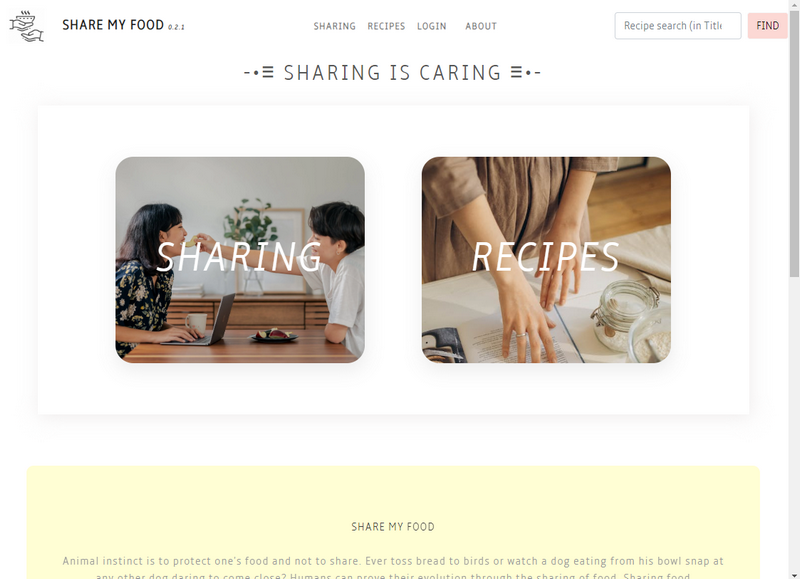

# Share My Food

 
<h3>Final Project by Victor and Abdullah</h3>
<h5><strong>Full Stack App and Web Development Course</strong>
 
- WBS Berlin, WD#020 (Jan,2022)</h5>

<strong>Deployments :</strong>
 
&emsp;<u>V2</u>
 
&emsp;• Test-release: <a href="https://sharemyfood-prerelease.vercel.app">(vercel) sharemyfood-test-v2</a>
 
&emsp;• Stable-release: <a href="https://sharemyfood.vercel.app">(vercel) sharemyfood-v2</a>
 
&emsp;<u>V1</u>
 
&emsp;• Pre-release: <a href="https://vrwgh-finalprojectwd020.netlify.app">(netlify) sharemyfood-v1</a>
<h2></h2>
<strong>Sources:</strong><small> &emsp;<a href="https://vrw-gh.github.io/final-project-wd020">GH Page</a>&emsp;•&emsp;<a href="https://github.com/vrw-GH/final-project-wd020">GH Repo</a>&emsp;•&emsp;<a href="https://vrw-gh.github.io/sharemyfood-backend/">Backend</a></small>
 
<h2></h2>
<strong>🎥 Making Of: ...</strong><a href="https://clipchamp.com/watch/mT0F1UjGS6m?utm_source=embed&utm_medium=embed&utm_campaign=watch" target="_blank">(Watch on ClipChamp)</a>
 
<object data="https://vrw-gh.github.io/final-project-wd020/project-basics/SMF-Presentation.mp4" width="400" height="300"></object>
 

<h2>Javascript Full-Stack App - P.E.R.N Stack</h2>

- Frontend: REACT v17.0.2
  - Single-Page App with React Router
  - Backend spin-up indication (due to delay in render)
  - Dev mode indicator
  - Simple SVG Map to show location
  - Carousel - with auto play, clickable
  - Recipe Filter by ingredients
  - Tabbed elements
  - Built-in Modal form  
  - Easter-egg!

- Backend: Node
  - REST Api (hosted on Render/~~Heroku~~)
  - With German Postcode lookup endpoint
  - Database: PostgreSQL (ElephantSQL online) or MySQL (local server
<!-- - Other:
  - xxx -->
<object data="./project-basics/app-features.txt" width="100%" height="auto" style="margin: 0"></object>
